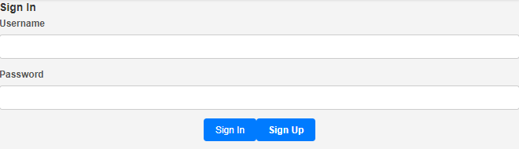
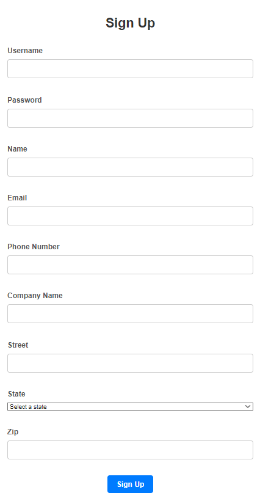
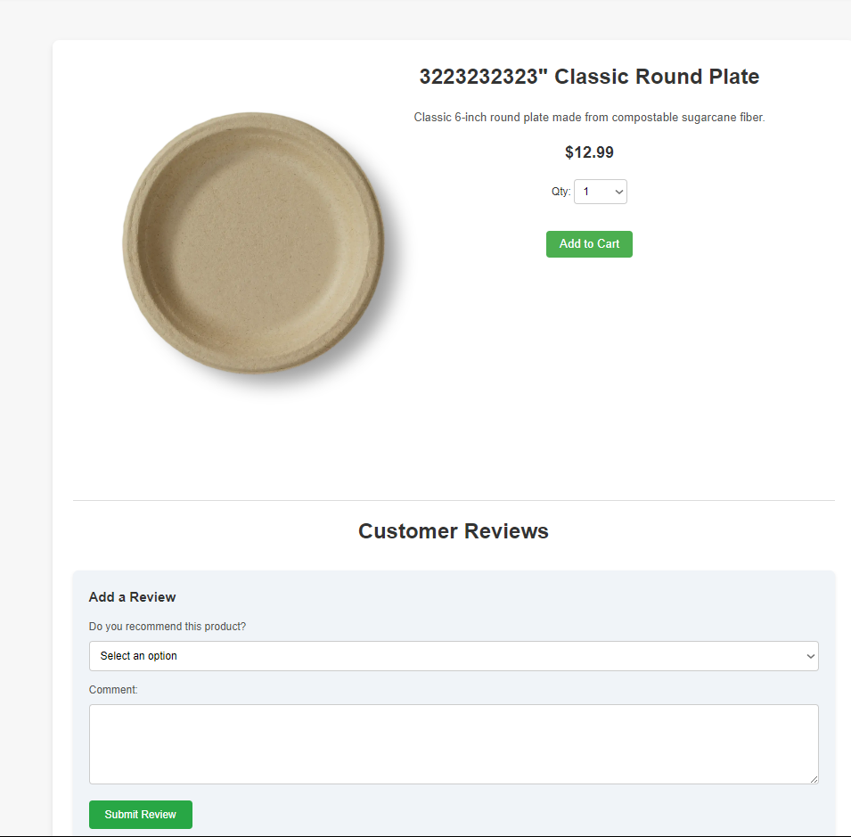
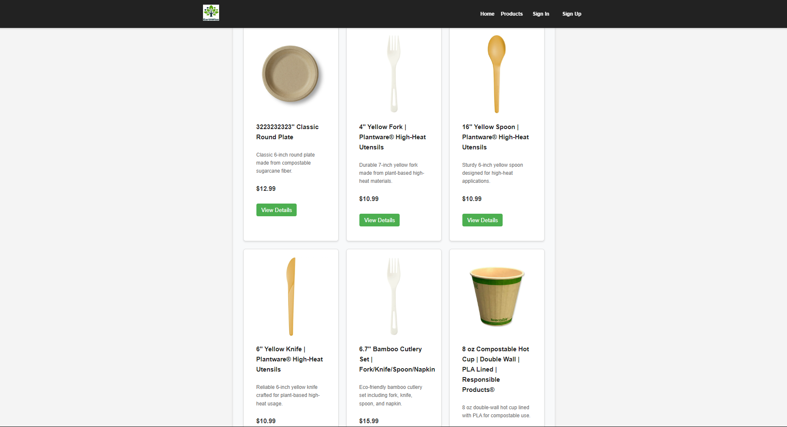
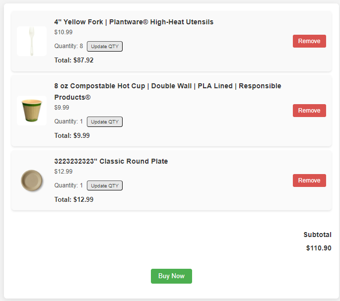
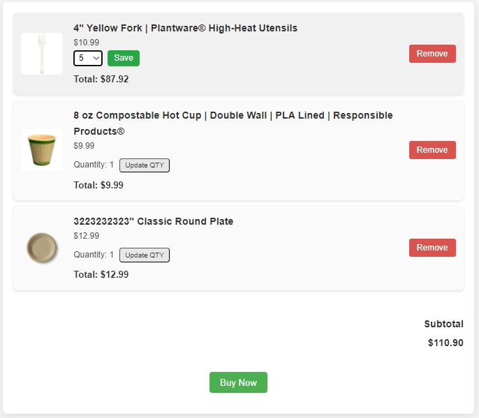
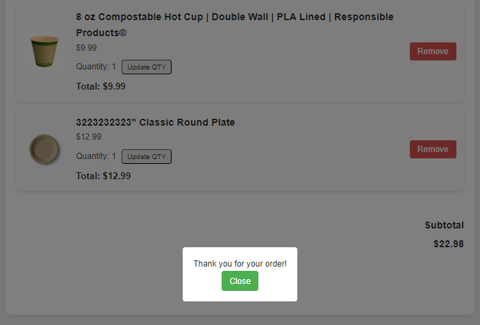
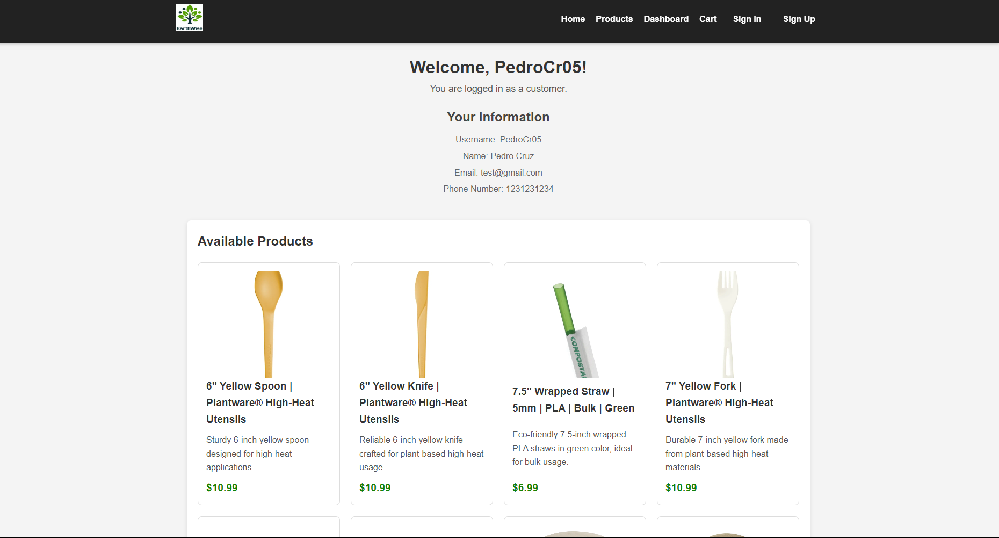
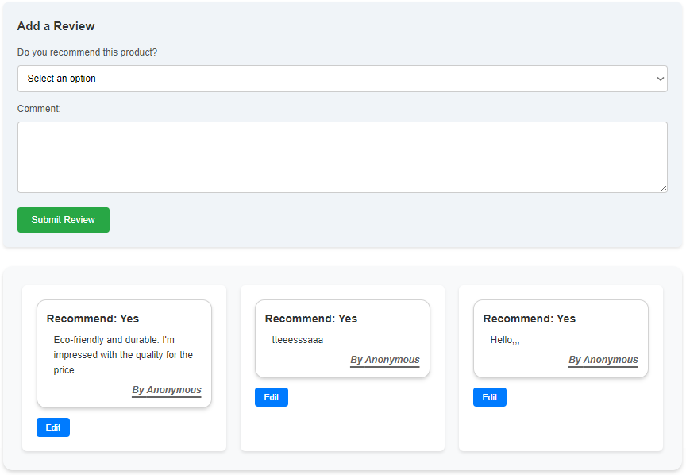
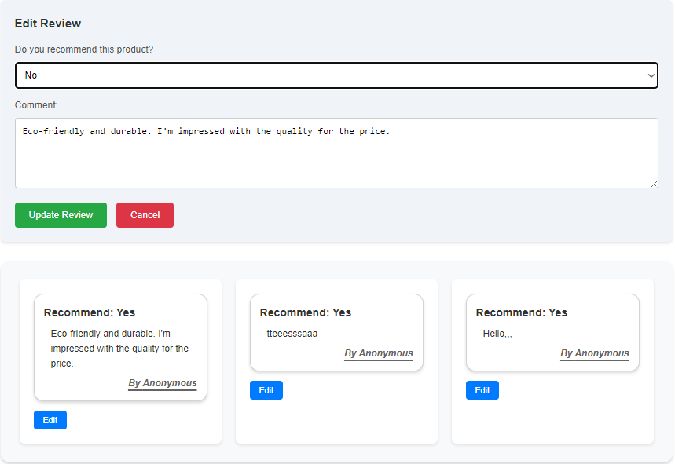

  

# EARTHWISE PACKAGING

## Project Description

Welcome to **Earthwise Packaging**, where we’re on a mission to help the food industry go green!
  Our site offers eco-friendly essentials, from composable cups to biodegradable utensils.
 Think of us as an eco-supplier, making it easy for businesses to browse, buy, and breathe easier knowing they’re reducing waste.
 Together, we’re packing up pollution and unboxing a greener future one composable fork at a time!

## Table of Contents

### [📚](#table-of-contents) | The books is a clickable emoji, so you can redirect back to this list!

- **_[Tech Stack](#tech-stack)_**
- **_[Back End Repository](#back-end-repository)_**
- **_[How to Download & Run](#how-to-download--run-the-project)_**
- **_[Site Features](#site-features)_**
  - **_[Sign In, Up, & Out Feature](#sign-in-up--out-feature)_**
  - **_[Product Based](#product-based)_**
  - **_[Cart Area](#cart-area)_**
  - **_[User's Dashboard/Information](#users-dashboardinformation)_**
  - **_[Reviews Section](#reviews-section)_**
- **_[Developers](#who-created-this-project)_**
- **_[Back Logs](#project-backlog)_**

## Tech Stack

##### [📚](#table-of-contents)

| Section       | Technology Used       |
| ------------- | --------------------- |
| **Frontend:** | Axios, CSS, _&_ React |

## Back End Repository

##### [📚](#table-of-contents)

- [Back end](https://github.com/jharreldesign/Earthwise-Packaging-Server/tree/PedroCr05)
- [Deployment](https://earthwisepackaging.netlify.app)

## How to Download & Run the Project

##### [📚](#table-of-contents)

### Prerequisites

1. Node.js v14+
2. npm v6+
3. MongoDB Account

### Fork & Clone

1. Clone the repository: `git clone https://github.com/<yourusername>/earthwise-packaging.git`
2. Navigate into the directory: `cd earthwise-packaging`
3. Install dependencies: `npm install`

### Starting the Development Server

1. Run `npm run dev` to launch the local server.
2. Visit `http://localhost:3000` in your browser to see the project.
3. It is advised to run **both** the **_Back End_** _&_ **_Front End_** Simiulatiously.

## Site Features

### Sign In, Up, & Out Feature

##### [📚](#table-of-contents)

#### Sign In

#### Sign Up

##### Sign Out

---

### Product Based

##### [📚](#table-of-contents)

#### Product Details Page

#### View Products Page

---

### Cart Area

##### [📚](#table-of-contents)

#### View Cart Page

#### Update Product Quantity

#### Products Purchased

---

### User's Dashboard/Information

##### [📚](#table-of-contents)

#### Account details

---

### Reviews Section

##### [📚](#table-of-contents)

#### Creating a Review

#### Updating a Review

## Who worked on the front-end?

##### [📚](#table-of-contents)

| Developers | _What Part?_ |
| ---------- | ------------ |
| `Jason:`   | [x]          |
| `Jessica:` | [x]          |
| `Pedro:`   | [x]          |

## Project Backlog

##### [📚](#table-of-contents)

### [▶](https://github.com/users/jharreldesign/projects/1) Kanban/Back Logs
